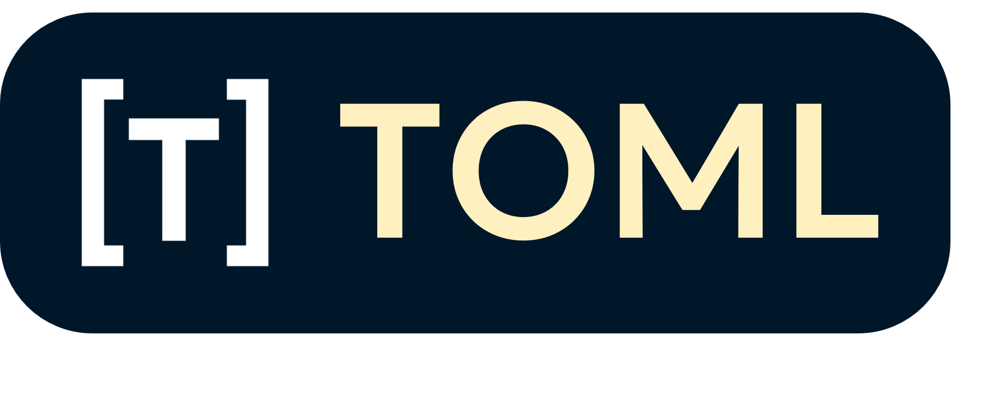
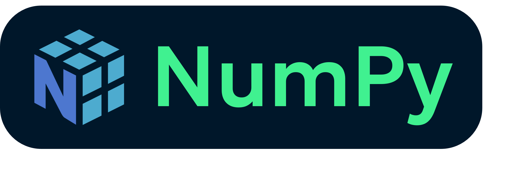
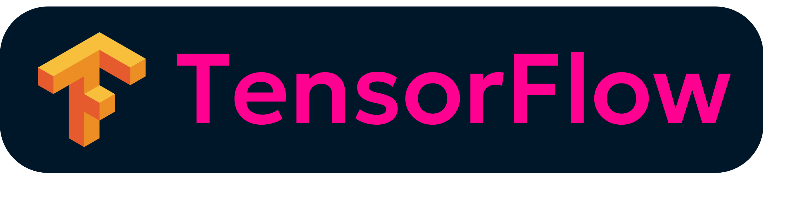
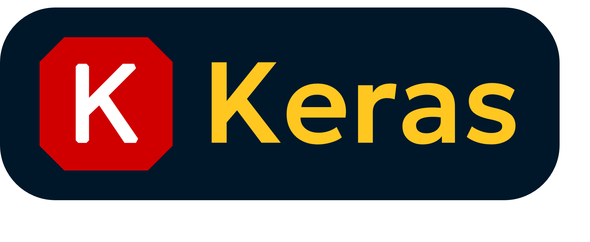

[**An avid portal with way too much in their neural cortex.**](https://sup2point0.github.io/Assort)

---

sup o/

Damn, there’s so much I want to have here that I don’t even know what to include.

Um, carrots are cool. And light mode is awesome.

If you feel like delving into my universe, head to my super-repo mega-wiki [*Assort*](https://github.com/Sup2point0/Assort) or its [site↗](https://sup2point0.github.io/Assort)! Who knows, by the time you finish all of it perhaps I’ll have added twice as many files... (not really)

I’ve had my fair share of catastrophic merge conflicts (and merge-commit-less merge conflicts, would you believe it), tho I’m sure there’s ever more to come. Also don’t worry about my mildly ridiculous commit count, I have a lot of repos and often make micro-commits on the go :v

Anyway, I’ve hit my self-imposed character limit, so... I’ll leave you to explore ;)

---

<!-- content kinda ordered in significance -->

## Languages

 

<!--  -->

 

 

 

<!--  -->

## Frameworks

## Applications

 

## Loves

## Aptitudes

---

[ [ **VIEW MORE** ](https://github.com/Sup2point0/Assort/blob/origin/sup.md) ]

<!-- bit long, yeah, but I really couldn’t bring myself to exclude any of it :v -->
