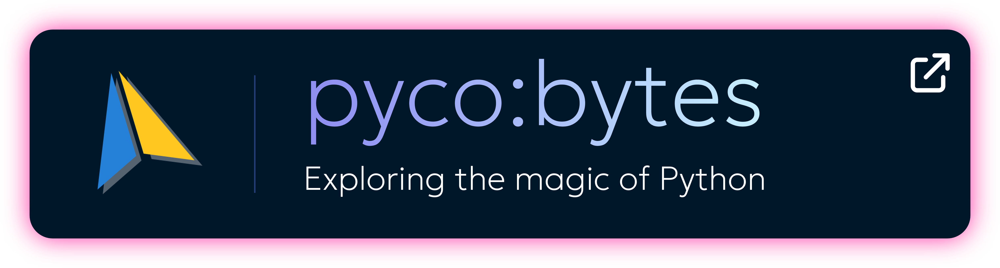
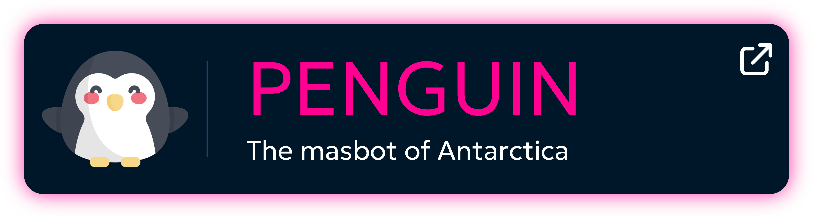
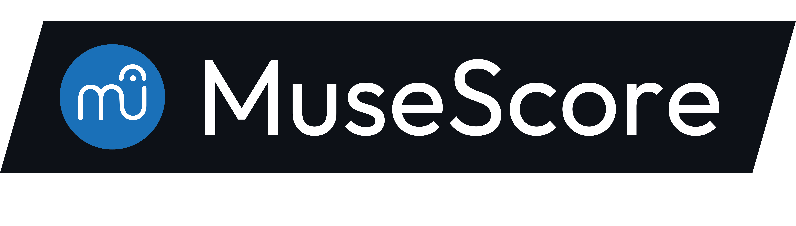
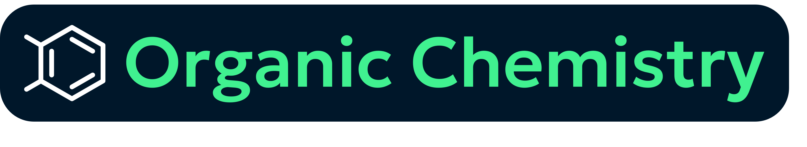
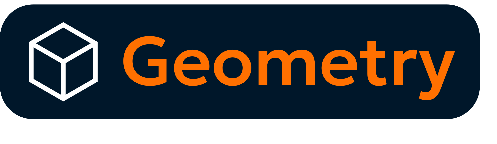
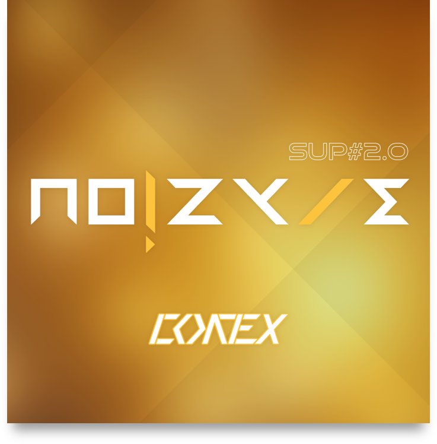

[**An avid portal with way too much in their neural cortex.**](https://sup2point0.github.io/Assort)

<!--  -->

---

sup o/

Analysis paralysis has rendered me incapable of deciding what to write here, sooo...

Carrots are cool. And light mode is awesome.

I’m just an adventurer creating stuff I love. Recently, that’s been algorithms in Haskell alongside a crippling Rust addiction.

If you feel like delving into my universe, head to my super-repo megawiki [*Assort*](https://github.com/Sup2point0/Assort) or its [site↗](https://sup2point0.github.io/Assort)!

---

  

## Projects

<!--  -->

## Languages

 

 

## Applications

  

 

## Loves

<!--  -->

<!--  -->

## Music

---

I’ve had my fair share of catastrophic merge conflicts (and merge-commit-less merge conflicts, would you believe it), tho I’m sure there’s ever more to come. Oh, and don’t worry about my ridiculous commit counts, it’s all micro-commits on the go hehe

---

[ [ **VIEW MORE** ](https://sup2point0.github.io) ]

