

An avid portal with way too much in their neural cortex.

---

\o sup, I’m Sup o7

Damn, there’s so much I want to include here that I don’t know what to put here.

Um, carrots are cool. Also light mode is awesome.

If you’re new here, you could drop into my [site↗](https://sup2point0.github.io). If you’re bored and feel like delving into my universe, my super-repo [*Assort*](https://github.com/Sup2point0/Assort) is literally endless – and who knows, maybe by the time you finish all of it I’ll have added twice as many files! (not really)

I’ve had my fair share of catastrophic merge conflicts (and even merge-commit-less merge conflicts, would you believe it), tho I’m sure there’s ever more to come. Also don’t worry about my mildly ridiculous commit count, I have a lot of repos and often make micro-commits when on the go :v

Anyway, I’ve hit my self-imposed character limit, so... I’ll leave you to explore ;)

---

## Languages

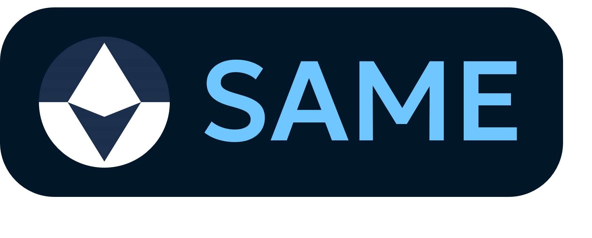
 

 

## Technologies

## Loves

 

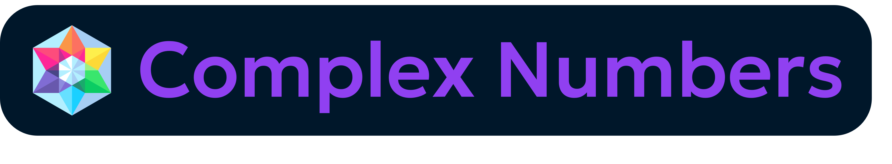
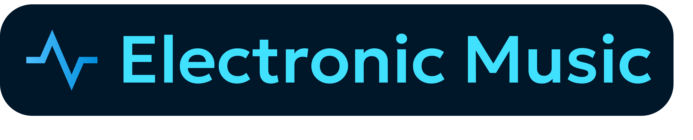

## Aptitudes

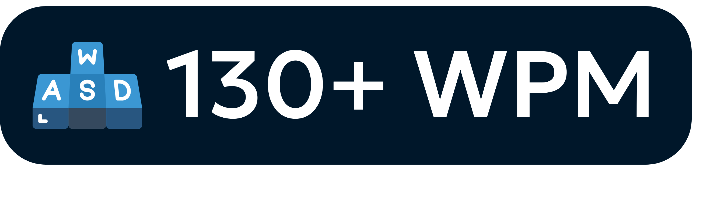
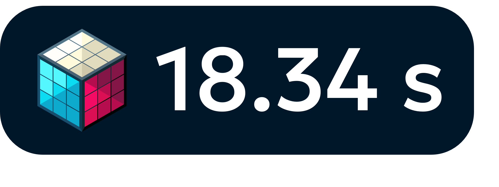

## Qualities

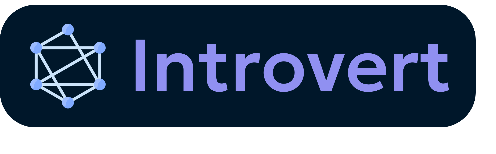

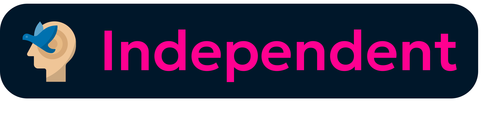
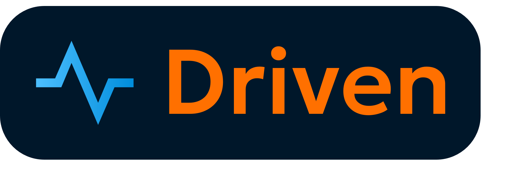
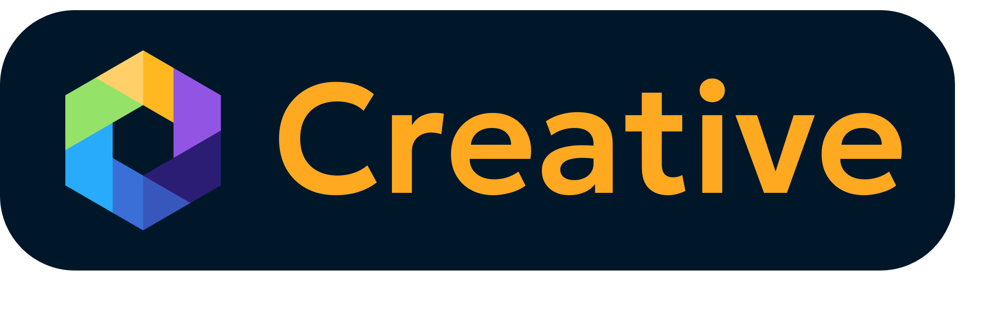
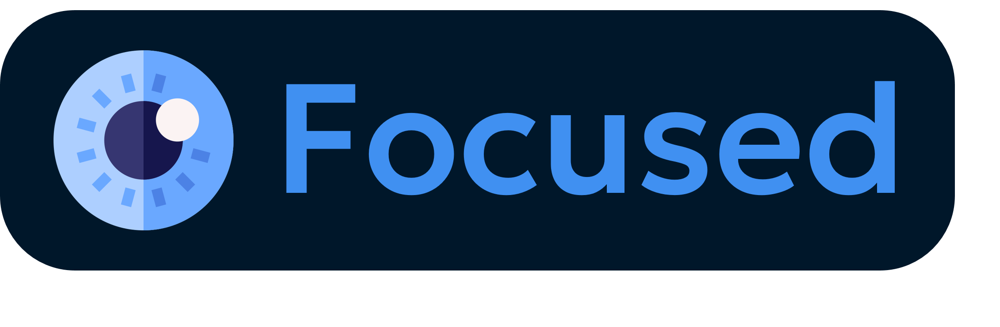
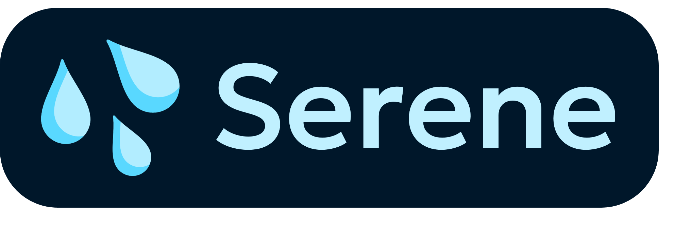
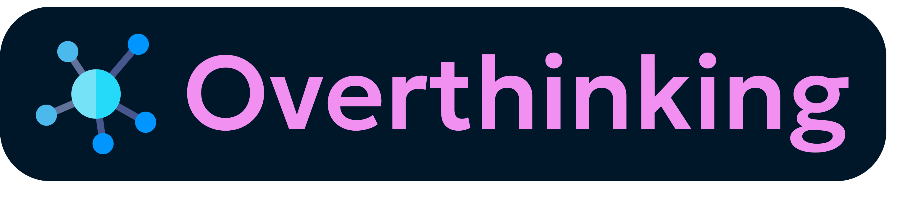
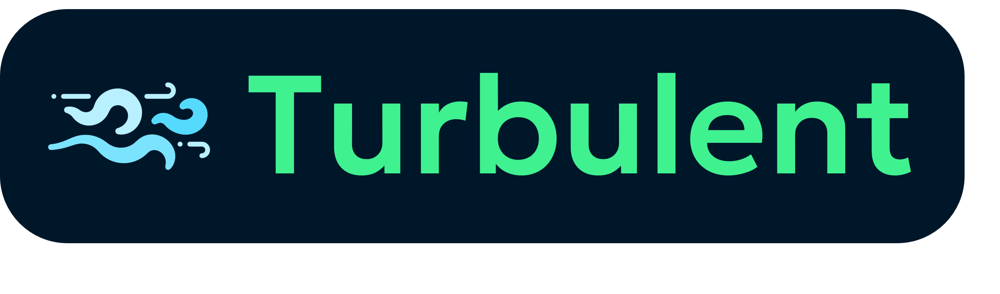

---

[ [ **VIEW FULL PROFILE** ](https://github.com/Sup2point0/Assort/blob/origin/sup.md) ]

