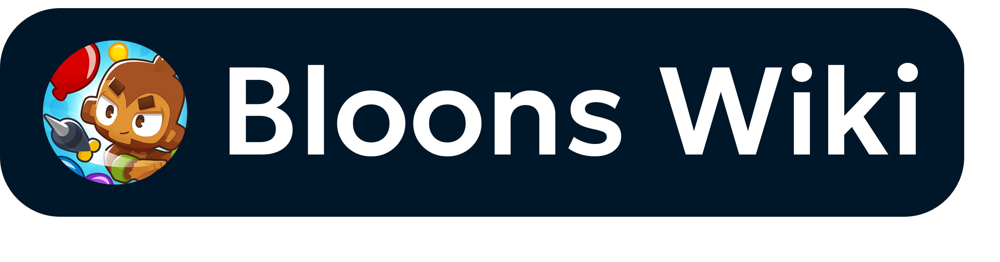

An avid portal with way too much in their neural cortex.

---

\o sup, I’m Sup o7

Damn, there’s so much I want to include here that I don’t know what to put here.

Um, carrots are cool. Also light mode is awesome.

If you’re new here, you could drop into my [site↗](https://sup2point0.github.io). If you’re bored and feel like delving into my universe, my super-repo [*Assort*](https://github.com/Sup2point0/Assort) is literally endless – and who knows, maybe by the time you finish all of it I’ll have added twice as many files! (not really)

Anyway, I’ve hit my self-imposed character limit, so... I’ll leave you to explore ;)

---

## Qualities

## Languages

 

 

## Technologies

## Loves

 

## Aptitudes

<!--

## Qualities

 
 
 
 

## Interests

 
 
 
 

 
 
 

-->

---

[ [ **VIEW FULL PROFILE** ](https://github.com/Sup2point0/Assort/blob/origin/sup.md) ]

